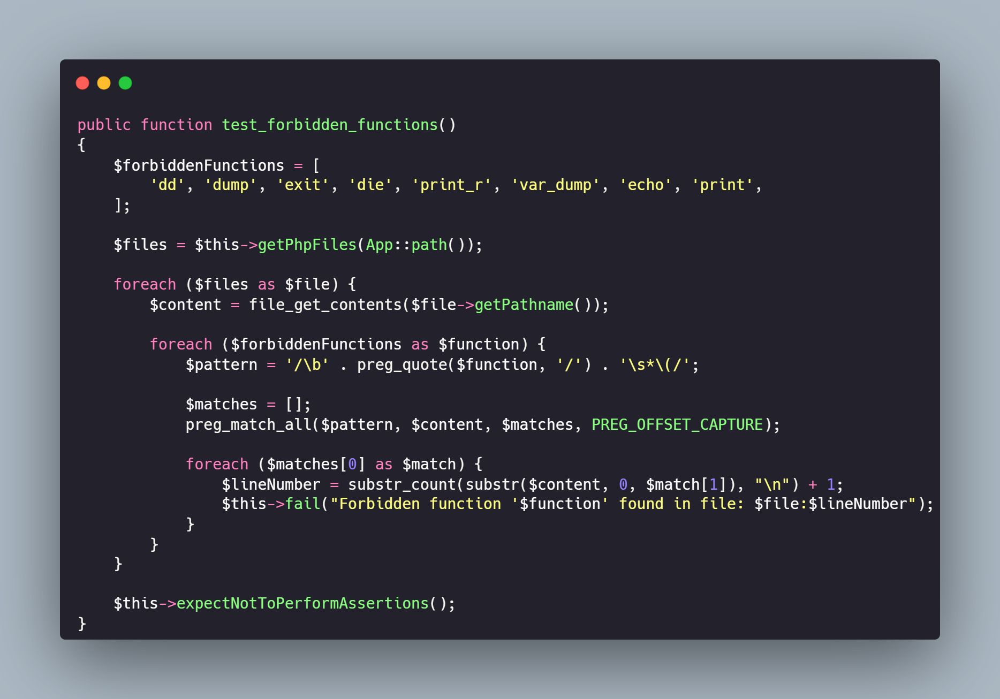
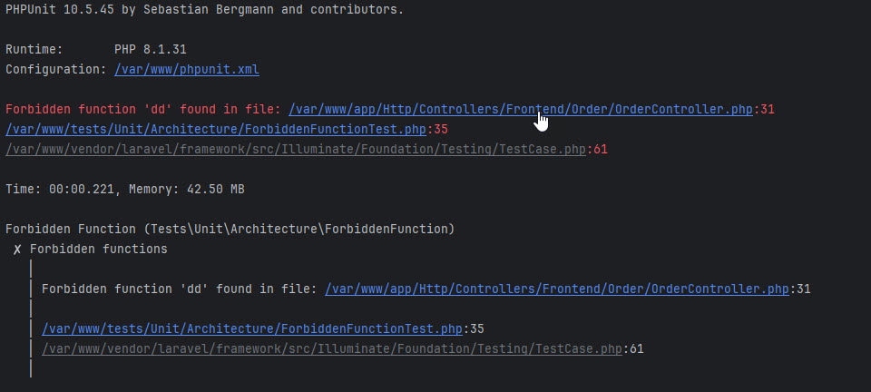

## Introduction

Debugging is an important part of software development, and Laravel provides helpful functions like dd() and dump() to
check variables at development time. These functions should never be left in production code, since they can
disclose sensitive information, delay execution, or display unwanted information to consumers.

To ensure accidental inclusion of these functions in your codebase add automated checks such as tests, cd/cd pipelines,
and static analysis tools like PHPStan.

Pest, a modern PHP testing framework, provides elegant way to detect the presence of such functions using
architecture testing. But what if you are using PHPUnit instead of Pest? This article will guide you on how to implement
a **Forbidden Function Test** in PHPUnit to ensure these debugging functions are not present in your laravel codebase.

## Detecting Forbidden Functions with Pest

Detecting disallowed debugging functions is easy if you are using Pest. You should write an architectural test like
this:

```php
arch('globals')
->expect(['dd', 'dump', 'var_dump'])
->not->toBeUsed();
```

This test checks the usage of dd(), dump(), var_dump() functions in the code base and fails if any of them are found.

## Implementing Forbidden Function Test in PHPUnit

For those who using PHPUnit, a similar test can be written manually by scanning all PHP files in the application
directory and checking for forbidden function calls.

### The Test Case

Create test file at `tests/Unit/Architecture/ForbiddenFunctionTest.php` and add the following code:



[Full test code](https://gist.github.com/tegos/0fa95dbf5dbce39b969399dd7161921b)

### How It Works

1. **Define Forbidden Functions:** The test defines forbidden functions like `dd()`, `dump()`, `exit()`, `die()`, etc.
2. **Scan PHP Files:** The test scans all PHP files in the Laravel `app/` directory recursively.
3. **Check for Forbidden Functions:** The test uses regex to check for forbidden function calls and mark their
   locations.
4. **Fail on Detection:** On detection of any forbidden function, the test fails, displaying the filename and line
   number
   where the function is located.

## Running the Test

To execute the test, run the following command:

```sh
vendor/bin/phpunit --filter 'test_forbidden_functions'
```

If test fails it will output a message indicating the file and line number where a forbidden function is used. This
allows you to quickly navigate to the relevant file in your IDE, such as PhpStorm, and make the necessary corrections.



## Conclusion

For a secure and organized Laravel application, debugging functions should not be used in production. This is made
simple by Pest, but PHPUnit requires manual labor. By including this test in your CI/CD workflow, you may identify these
features early and maintain a dependable and clean codebase.
