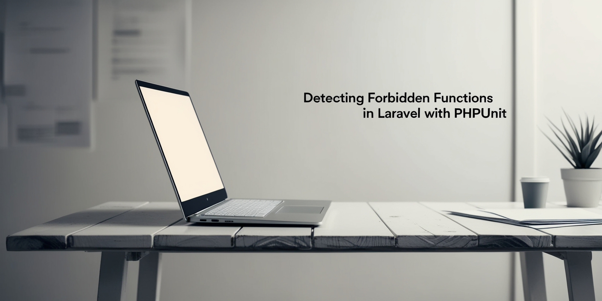

# Detecting Forbidden Debugging Functions in Laravel



## Overview

Debugging functions like `dd()`, `dump()`, and `var_dump()` are useful during development but should never be present in
production code. This article explains how to automatically detect and prevent these functions using Pest and PHPUnit.

## Detecting Forbidden Functions

- **Pest**: Use an architectural test to block specific debugging functions.
- **PHPUnit**: Implement a custom test that scans PHP files for forbidden functions and fails if any are found.

## Running the Test

To run the test in PHPUnit:

```sh
vendor/bin/phpunit --filter 'test_forbidden_functions'
```

The test will output the file and line number where a forbidden function is detected, helping you quickly resolve the
issue.

## Why This Matters

By integrating this test into your CI/CD pipeline, you can ensure a clean and secure Laravel codebase, preventing
accidental use of debugging functions in production.

[Read the full article](https://dev.to/tegos/detecting-forbidden-functions-in-laravel-with-phpunit-4n6f)  
[Full test code](https://gist.github.com/tegos/0fa95dbf5dbce39b969399dd7161921b)
